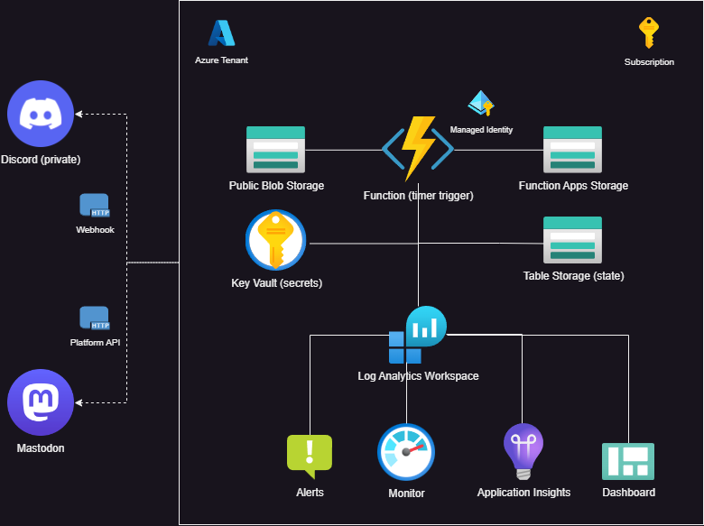

# RateMy8K 

1. [Overview](#overview)
2. [Design](#design)
3. [Notifications](#notifications)

### Overview 
Since mid-2023, the Securities and Exchange Commission (SEC) implemented new requirements that,"[require public companies to disclose material cybersecurity incidents](https://www.sec.gov/newsroom/speeches-statements/gerding-cybersecurity-incidents-05212024)". This information is available to the public via the SEC.gov website via manual searches, however RateMy8K is a SEC.gov EDGAR scanner that searches for new filings and sends out notifications proactively. 

### Notifications 
Notifications are sent to the platforms below. Over time, I'd like to expand this to other platforms or integrations. 

- **Mastodon**: The primary platform for notifications is the [RateMy8K Mastodon Account](https://mastodon.social/@ratemy8k). This account can be viewed by anyone in a browser, but a logged in Mastodon account is required in order to follow RateMy8K for proactive notifications.

- **Discord**: This feature currently only sends to my personal Discord server for testing and debugging. 

### Design 

 
 
This solution is built 100% in the Azure cloud using serverless resources.

- The function app runs on a timer that reaches out to the public SEC.gov API endpoints to fetch the newest [Form 8-K](https://www.sec.gov/answers/form8k.htm) filings. 
- From the list of recent filings, the function checks if they are for the correct item classification this process is looking for as the 8-K form has a number of different uses. 
- Once a filing is found targeting the **Item 1.05: Material Cybersecurity Incidents** classification, it is saved to low-cost structured NoSQL storage. 
- The filings are then formatted into message payloads that are sent to configured platforms. 

